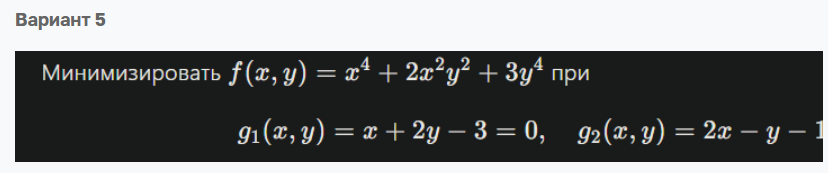
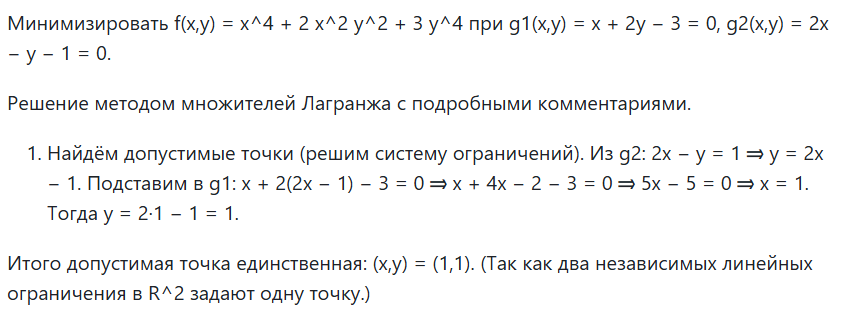
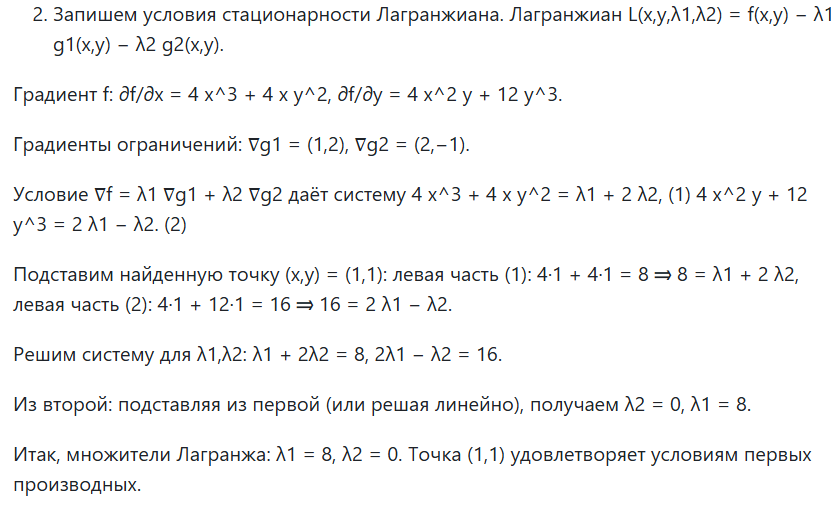
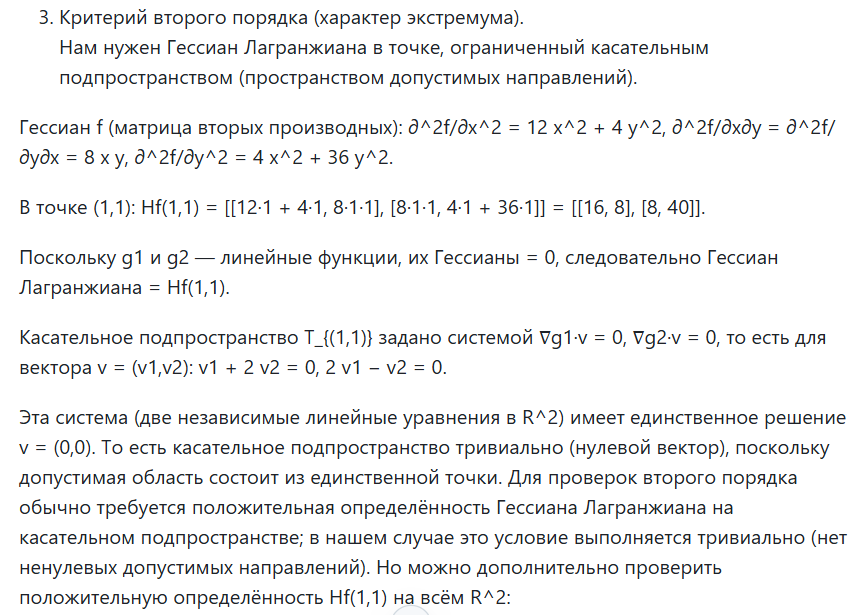
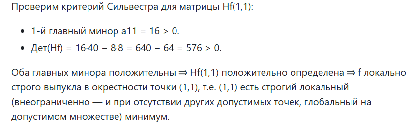
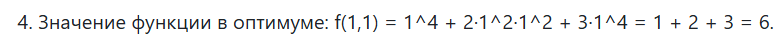

# Отчет по лабораторной работе: Решение задачи условной выпуклой оптимизации с помощью метода множителей Лагранжа

### Выполнила: Смирнова Карина Андреевна Поток 1.1 К3341

### Задание:

В работе предлагается решить задачу условной оптимизации с помощью метода множителей Лагранжа.

Задачу можно решить самостоятельно, либо с помощью большой языковой модели (БЯМ). 

Как решать с помощью БЯМ?

Шаблон промпта:

Ниже приведена задача условной оптимизации, которую требуется решить с помощью метода множителей Лагранжа. Она записана
в Markdown формате. Пожалуйста идентифицируй задачу и реши ее с помощью метода множителей Лагранжа. Проверь характер 
найденных точек с помощью критерия Сильвестра.

Далее в промпт вставляете MarkDown запись задачи (см. вариант задания) из запускаете. Далее просматриваете и 
анализируете сгенерированный ответ и комментируете - что сделала БЯМ в том или ином действии, верно ли действие или 
есть ошибка (укажите характер ошибки).

### Задание по варианту 5



Минимизировать $f(x,y)=x^4+2x^2y^2+3y^4$ при
$$
g_1(x,y)=x+2y-3=0,\quad g_2(x,y)=2x-y-1=0.
$$

### Выполнение

Я написала следующий промпт:

Ты профессионал в области методов оптимизации, особенно в методе множителей Лагранжа. Ниже приведена задача условной 
оптимизации, которую требуется решить с помощью метода множителей Лагранжа. Она записана в Markdown формате. Пожалуйста 
идентифицируй задачу и реши ее с помощью метода множителей Лагранжа. Проверь характер найденных точек с помощью критерия
Сильвестра. Пиши подробное решение с комментариями своих действий.

Минимизировать $f(x,y)=x^4+2x^2y^2+3y^4$ при
$$
g_1(x,y)=x+2y-3=0,\quad g_2(x,y)=2x-y-1=0.
$$

##### Решение Copilot шаг 1



На первом шаге составляется система ограничений, чтобы найти допустимые точки

g2: 2x − y = 1 ⇒ y = 2x − 1. 

Подставим в g1: x + 2(2x − 1) − 3 = 0 ⇒ x + 4x − 2 − 3 = 0 ⇒ 5x − 5 = 0 ⇒ x = 1. 

Тогда y = 2·1 − 1 = 1.

Итого допустимая точка единственная: (x,y) = (1,1). 
(Так как два независимых линейных ограничения в R^2 задают одну точку.)

Мы выражали x и y после составления Лагранжиана и нахождения частных производных.

Если искать таким способом, то результат получается тот же:

Для Лагранжиана L(x,y,λ1,λ2) = x^4 + 2x^2y^2 + 3y^4 − λ1(x+2y−3) − λ2(2x−y−1) частные производные равны:

```
∂L/∂x = 4x^3 + 4xy^2 − λ1 − 2λ2
∂L/∂y = 4x^2y + 12y^3 − 2λ1 + λ2
∂L/∂λ1 = −(x + 2y − 3)
∂L/∂λ2 = −(2x − y − 1)
```

Выразим x и y:
```
x + 2y − 3 = 0
2x − y − 1 = 0

x = 3 − 2y
2(3 − 2y) − y = 1 → 6 − 4y − y = 1 → 5y = 5 → y = 1.

x = 3 − 2·1 = 1
```

Итог: x = 1, y = 1.

Как мы увидим в следующем пункте значения совпали.

##### Решение Copilot шаг 2



На втором шаге составляется функция Лагранжа, находятся частные производные, находятся y - (лямбда).

Лагранжиан: L(x,y,λ1,λ2) = f(x,y) − λ1*g1(x,y) − λ2*g2(x,y).

Далее находятся частные производные, составляются градиенты (хотя мы градиентов не составляли, это просто более удобная форма)

Градиент f: ∂f/∂x = 4*x^3 + 4*x*y^2, 
            ∂f/∂y = 4*x^2*y + 12*y^3.

Градиенты ограничений: ∇g1 = (1,2), 
                        ∇g2 = (2,−1).

Составляем градиент для функции и находим коэффициенты лямбда:
```
∇f = λ1*∇g1 + λ2*∇g2  ⇒  4*x^3 + 4*x*y^2 = λ1 + 2*λ2    ⇒  λ1 + 2*λ2 = 8    ⇒   λ2 = 0
                          4*x^2*y + 12*y^3 = 2*λ1 − λ2      2*λ1 − λ2 = 16       λ1 = 8
```

Итак, множители Лагранжа: λ1 = 8, λ2 = 0. Точка (1,1) удовлетворяет условиям первых производных.

##### Решение Copilot шаг 3




На 3 шаге составляем матрице Гессе из вторых частных производных. Проверяем критерий Сильвестра.

Гессиан f (матрица вторых производных): 

```
∂^2f/∂x^2 = 12*x^2 + 4*y^2, 
∂^2f/∂x∂y = ∂^2f/∂y∂x = 8*x*y, 
∂^2f/∂y^2 = 4*x^2 + 36*y^2.
```

В точке (1,1): Hf(1,1) = 
```
[[12·1 + 4·1, 8·1·1]
[8·1·1, 4·1 + 36·1]] = 
[[16, 8]
[8, 40]]
```

g1 и g2 — линейные функции, их Гессианы = 0, следовательно Гессиан Лагранжиана = Hf(1,1).

Проверка критерия Сильвестра для матрицы Hf(1,1):

1-й главный минор a11 = 16 > 0.

Детерминант(Hf) = 16·40 − 8·8 = 640 − 64 = 576 > 0.

Оба главных минoра положительны ⇒ Hf(1,1) положительно определена ⇒ 
f локально строго выпукла в окрестности точки (1,1), т.е. (1,1) есть строгий локальный (внеограниченно — и при 
отсутствии других допустимых точек, глобальный на допустимом множестве) минимум.

##### Решение Copilot шаг 4



Значение функции в оптимуме: f(1,1) = 1^4 + 2·1^2·1^2 + 3·1^4 = 1 + 2 + 3 = 6.

### Вывод

Чат GPT решил задачу верно, хотя и немного не таким методом как делали это в классе. Также чат GPT дал подробные
объяснения.
