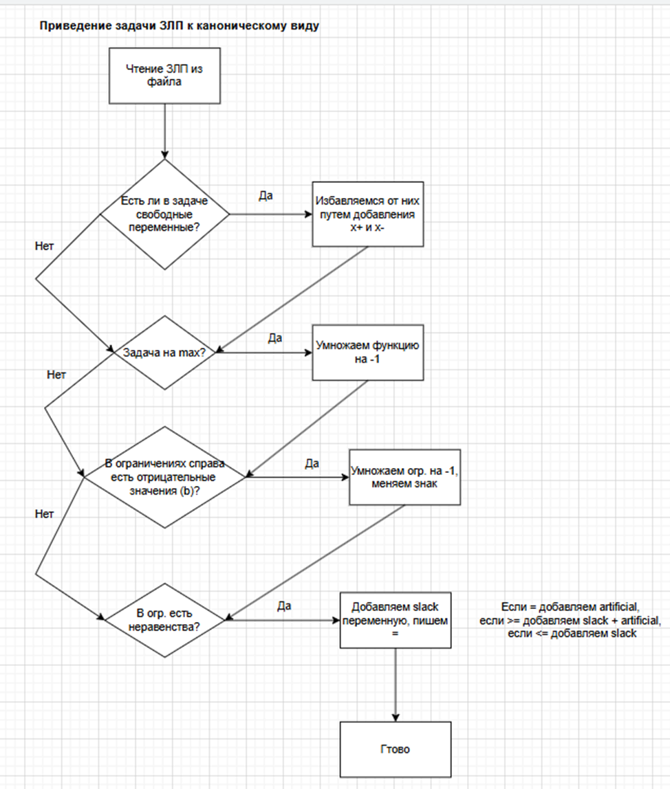
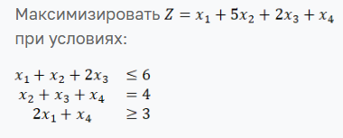

# Отчет по лабораторной работе: Решение ЗЛП

### Выполнила: Смирнова Карина Андреевна Поток 1.1 К3341

### Задание:

Разработать программу, которая будет решать ЗЛП. На вход дается текстовый файл с общей ЗЛП (формат придумываете свами).
На выходе либо информации о существовании решения: оно существует, оптимальное значение целевой функции, вектор x, при
котором данное решение достигается. Либо информация о том, что решения нет (либо критерий уходит в минус бесконечность,
либо множество X - область допустимых решений - пусто. Использование библиотек для решения оптимизационных задач
недопустимо. Но допускается использования библиотек для работы с массивами. В функционале должно предусматриваться:
преобразование в канонический вид, определение опорного решения (в том числе через вспомогательную задачу, если
возможно), решение основной задачи.

### Общий алгоритм решения (блок-схема):



Описание работы методов можно посмотреть в docstring методов.

### Инструкция по запуску кода

1. Скопировать к себе репозиторий
2. В файл lp.txt занести свою задачу в формате
    ```
   (min/max) коэффициенты целевой функции черех пробел
   vars: + free (где free свободная, а + больше равно 0)
   коэффициенты уравнения ограничения через пробел (знак =, >=, <=) b
   ....
   ```
   Пример:
   ```
   min -2 -3 1 -1 0 0
   vars: + + + + + +
   -1 -3 0 1 0 0 = 7
   2 0 6 0 1 0 = 5
   0 1 -1 0 0 1 = 2
   ```
3. Запустить файл two_phase_simplex

### Демонстрация работы программы

**Пример 1:**



```
max 1 5 2 1
vars: + + + +
1 1 2 0 <= 6
0 1 1 1 = 4
2 0 0 1 >= 3
```

**Решение:**

Оптимальное значение: 22.0

x1 = 2.0

x2 = 4.0

x3 = 0.0

x4 = 0.0

s1 = 0.0

s3 = 1.0

**Пример 2**

```text
min -2 1 -1
vars: + free +
-3 2 -1 >= -6
1 1 1 <= 5
```

**Решение:**

Оптимальное значение: 5.5

x1 = 0.49999999999999867

x2 = 0.0

x3 = 4.500000000000003

s1 = 0.0

s2 = 0.0

### Вывод по работе:

В данной работе я научилась реализовывать симплекс-метод для решения ЗЛП. Было сложно структурировать алгоритм под один
шаблон решения. Думаю, это задание было полезно, чтобы структурировать и суммировать свои знания в решении задач ЗЛП.