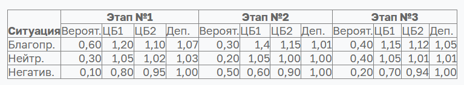
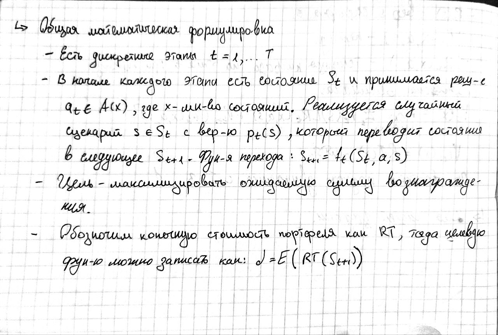
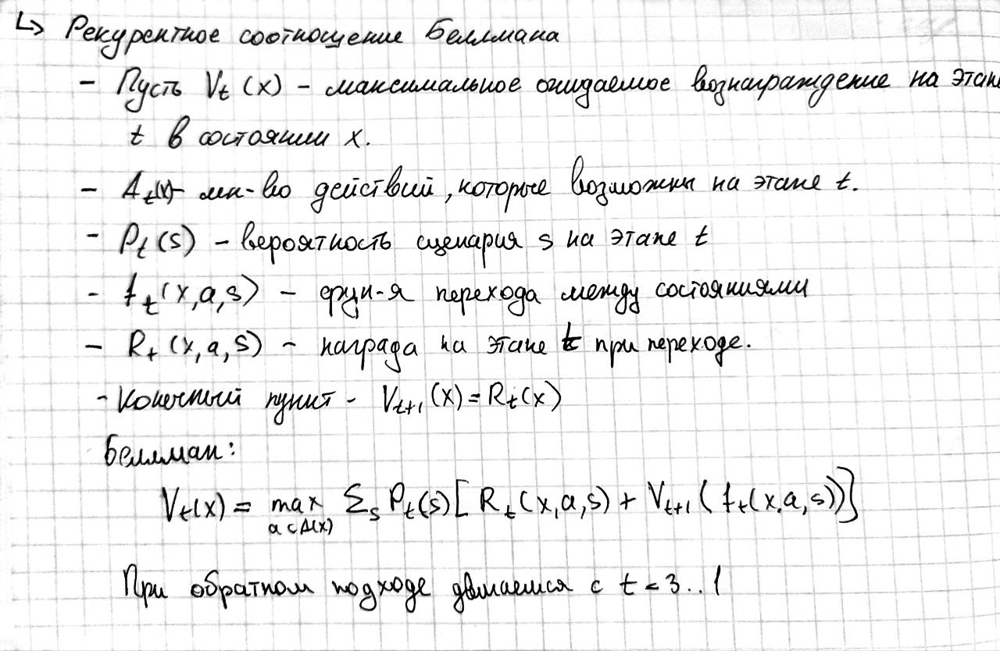
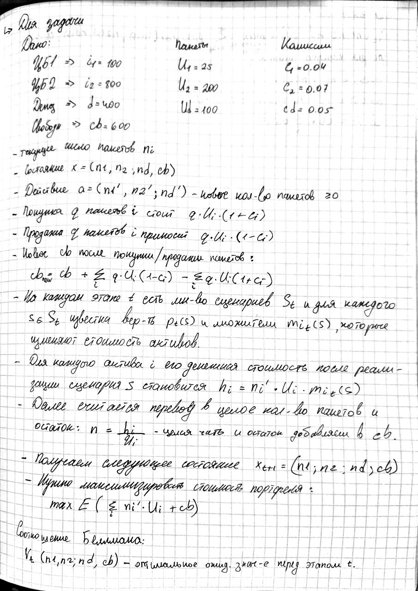
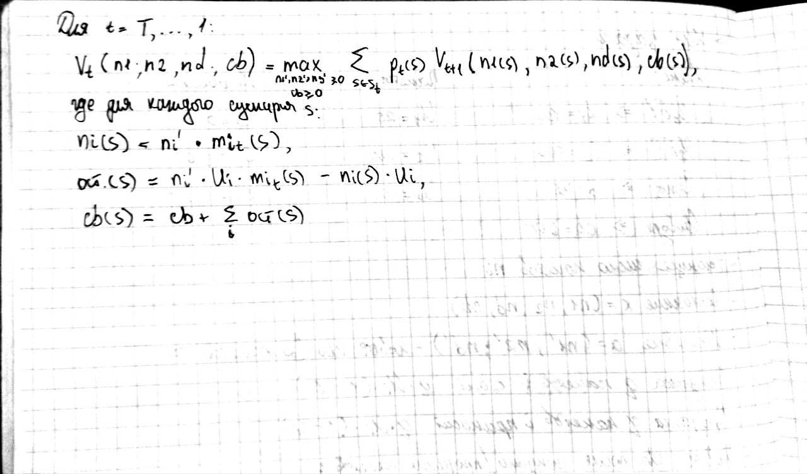
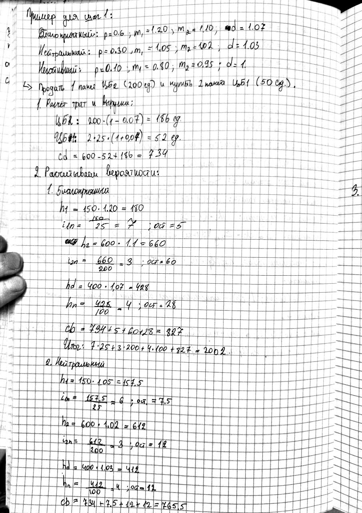
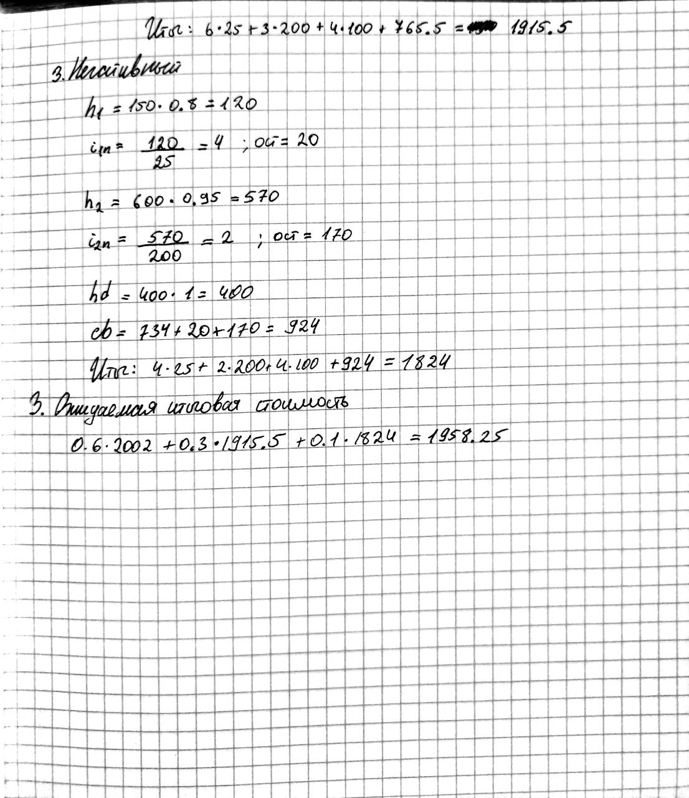
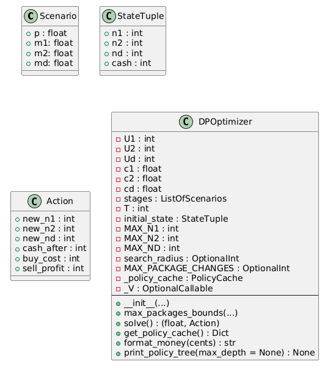

# Отчет по лабораторной работе: Метод ломаных

### Выполнила: Смирнова Карина Андреевна Поток 1.1 К3341

### Задание:

К началу периода планирования у инвестора было два вида ценных бумаг (ЦБ) и депозиты (Деп.) на сумму 100, 800, 400 
денежных единиц (д.е.) соответственно. В общих чертах говоря, Деп. – банковские вклады; при этом условия на все депозиты
одинаковые. Также в инвестора есть свободные средства в размере 600 д.е. Excel версия данных находится в приложенном 
файле.

Период планирования разбит на три этапа. Для каждого этапа известны вероятности наступления ситуации, которая может быть
«благоприятной», «нейтральной», «негативной» (обратите внимание, что вероятности событий в каждом этапе разные).

В зависимости от ситуации оценены изменения стоимости ценных бумаг и процентная ставка депозита. Данные приведены в 
таблице. Например, на первом этапе при реализации негативной ситуации (ее вероятность равна 0,1 или 10%) курс ЦБ1 
понизится на 20%, а Деп. не будет иметь дохода (коэффициент равен единице); или на этапе №2 при благоприятной ситуации 
(вероятность – 30%) ЦБ2 повысится на 15%, а Деп. даст доход в один процент; при нейтральной ситуации в третьем этапе 
(вероятность – 40%) – депозит даст доход один процент от суммы за один период.



Шаговым управлением является изменение объема фондов ценных бумаг и(или) депозитов на один или несколько пакетов одну 
четверть от первоначальной стоимости. Например, перед первым этапом инвестор может купить ЦБ1 в объеме 25 д.е. или 
продать депозиты в объеме 100 д.е. При увеличении объемов ценных бумаг и депозитов инвестор не может брать кредит, а 
распоряжаться только свободными средствами.

Требуется разработать такой план управления закупками/продажами ценных бумаг и депозитов, чтобы суммарный объем дохода 
был максимальным. Поскольку в задаче присутствуют вероятности, то для оценки дохода необходимо использовать критерии 
принятия решений в условиях неопределенности (при программной реализации Вы можете выбрать один из них, например, 
критерий Байеса).

**Варианты заданий (разной сложности)**

Для вышеприведенной задачи предлагается два задания:
1) составить математическую постановку задачи, выписать рекуррентное соотношение Беллмана, составить и оформить 
алгоритм решения задачи (за выполнение без замечаний дается 0,6 от максимальной величины балла);
2) кроме выполнения первого задания выполнить программную реализацию метода и определить наилучшее управление и 
максимальный доход; критерия принятия решений выбирает пользователь (за выполнение всего задания без замечаний 
дается до 5 баллов;

### Общая математическая формулировка задачи динамического программирования;



### Рекуррентное соотношение Беллмана



### Обозначения, постановка задачи, рекуррентное соотношение для конкретной задачи





#### Пример вычисления одного из сценариев на этапе t





### Псевдокод или схема основного алгоритма, который обеспечивает решение задачи динамического программирования;

```
Функция V(k, n1, n2, nd, cash):
    # k: текущий этап (1..T), если k == T+1 -> конец
    if k == T+1:
        return n1*U1 + n2*U2 + nd*Ud + cash  # Конечная стоимость

    best_EV = -inf  # Лучшее мат ожидание результата
    best_action = None

    total = n1*U1 + n2*U2 + nd*Ud + cash
    (max_n1, max_n2, max_nd) = bounds_based_on(total)  # разумные пределы

    for new_n1 in 0..max_n1:
      for new_n2 in 0..max_n2:
        for new_nd in 0..max_nd:
            # затраты на покупку и выручку от продажи с комиссиями
            buy_cost = sum_by_i max(new_ni - ni, 0) * Ui * (1 + ci)
            sell_profit = sum_by_i max(ni - new_ni, 0) * Ui * (1 - ci)
            cash_after = cash - buy_cost + sell_profit

            if cash_after < 0: continue  # нарушение ограничений

            EV = 0
            for каждый сценарий s в S_k:
                p = p_k(s)
                # денежная новая стоимость активов
                h1 = new_n1 * U1 * m{1,k}(s)
                h2 = new_n2 * U2 * m{2,k}(s)
                hd = new_nd * Ud * m{d,k}(s)

                next_n1 = floor(h1 / U1)
                next_n2 = floor(h2 / U2)
                next_nd = floor(hd / Ud)

                rem1 = h1 - next_n1 * U1
                rem2 = h2 - next_n2 * U2
                remd = hd - next_nd * Ud

                next_cash = cash_after + rem1 + rem2 + remd

                EV += p * V(k+1, next_n1, next_n2, next_nd, next_cash)

            if EV > best_EV:
                best_EV = EV
                best_action = (new_n1, new_n2, new_nd, cash_after)

    сохранить (k,n1,n2,nd,cash) -> (best_EV, best_action)
    вернуть best_EV
```

### Диаграмма классов

```text
@startuml
' Типовые алиасы, представленные как простые классы/структуры

class Scenario {
  + p : float
  + m1: float
  + m2: float
  + md: float
}

class StateTuple {
  + n1 : int
  + n2 : int
  + nd : int
  + cash : int
}

class Action {
  + new_n1 : int
  + new_n2 : int
  + new_nd : int
  + cash_after : int
  + buy_cost : int
  + sell_profit : int
}

@enduml

@startuml

class DPOptimizer {
  - U1 : int
  - U2 : int
  - Ud : int
  - c1 : float
  - c2 : float
  - cd : float
  - stages : ListOfScenarios
  - T : int
  - initial_state : StateTuple
  - MAX_N1 : int
  - MAX_N2 : int
  - MAX_ND : int
  - search_radius : OptionalInt
  - MAX_PACKAGE_CHANGES : OptionalInt
  - _policy_cache : PolicyCache
  - _V : OptionalCallable
  --
  + __init__(...)
  + max_packages_bounds(...)
  + solve() : (float, Action)
  + get_policy_cache() : Dict
  + format_money(cents) : str
  + print_policy_tree(max_depth = None) : None
}
@enduml
```



### Код

```python
from functools import lru_cache
import math
from typing import List, Tuple, Optional, Dict

Scenario = Tuple[float, float, float, float]   # (p, m1, m2, md)
StateTuple = Tuple[int, int, int, int]         # (n1, n2, nd, cash)
Action = Tuple[int, int, int, int, int, int]   # (new_n1,new_n2,new_nd,cash_after,buy_cost,sell_profit)

class DPOptimizer:
    def __init__(
        self,
        U1: float, U2: float, Ud: float,
        c1: float, c2: float, cd: float,
        stages: List[List[Scenario]],
        initial_state: StateTuple,
        max_n1_limit: int = 120,
        max_n2_limit: int = 40,
        max_nd_limit: int = 80,
        search_radius: Optional[int] = None,
        max_package_changes: Optional[int] = 8,
    ):
        # Конвертация в целые
        self.U1_c = int(round(U1 * 100.0))
        self.U2_c = int(round(U2 * 100.0))
        self.Ud_c = int(round(Ud * 100.0))
        # комиссии
        self.c1 = c1
        self.c2 = c2
        self.cd = cd
        # сценарии (p,m1,m2,md)
        self.stages = stages
        self.T = len(stages)
        # начальное состояние (n1,n2,nd,cash)
        self.initial_state = initial_state
        # ограничения на перебор
        self.MAX_N1 = max_n1_limit
        self.MAX_N2 = max_n2_limit
        self.MAX_ND = max_nd_limit
        self.search_radius = search_radius
        # ограничение на суммарные изменения пакетов за один шаг
        self.MAX_PACKAGE_CHANGES = max_package_changes
        self._policy_cache: Dict[Tuple[int,int,int,int,int], Tuple[int, Optional[Action]]] = {}
        self._V = None

    def max_packages_bounds(self, total_wealth_c: int):
        max_n1 = int(total_wealth_c // self.U1_c) + 1
        max_n2 = int(total_wealth_c // self.U2_c) + 1
        max_nd = int(total_wealth_c // self.Ud_c) + 1
        return min(max_n1, self.MAX_N1), min(max_n2, self.MAX_N2), min(max_nd, self.MAX_ND)

    def solve(self) -> Tuple[float, Optional[Action]]:
        @lru_cache(maxsize=None)
        def V(stage_index: int, n1: int, n2: int, nd: int, cash_c: int) -> Tuple[int, Optional[Action]]:
            key = (stage_index, n1, n2, nd, cash_c)
            # Итог:
            if stage_index >= self.T:
                total_c = n1 * self.U1_c + n2 * self.U2_c + nd * self.Ud_c + cash_c
                self._policy_cache[key] = (total_c, None)
                return total_c, None

            # Общая текущая сумма
            total = n1 * self.U1_c + n2 * self.U2_c + nd * self.Ud_c + cash_c
            max_n1, max_n2, max_nd = self.max_packages_bounds(total)

            # лимиты продажи
            max_sell_n1 = n1
            max_sell_n2 = n2
            max_sell_nd = nd

            # максимальные потенциальные покупки
            max_buy_n1 = max_n1 - n1
            max_buy_n2 = max_n2 - n2
            max_buy_nd = max_nd - nd

            if self.search_radius is None:
                delta1_range = range(-max_sell_n1, max_buy_n1 + 1)
                delta2_range = range(-max_sell_n2, max_buy_n2 + 1)
                delta3_range = range(-max_sell_nd, max_buy_nd + 1)
            else:
                lo1 = max(-max_sell_n1, -self.search_radius)
                hi1 = min(max_buy_n1, self.search_radius)
                lo2 = max(-max_sell_n2, -self.search_radius)
                hi2 = min(max_buy_n2, self.search_radius)
                lo3 = max(-max_sell_nd, -self.search_radius)
                hi3 = min(max_buy_nd, self.search_radius)
                delta1_range = range(lo1, hi1 + 1)
                delta2_range = range(lo2, hi2 + 1)
                delta3_range = range(lo3, hi3 + 1)

            best_EV = -10**30
            best_action = None

            use_pkg_limit = (self.MAX_PACKAGE_CHANGES is not None)

            for d1 in delta1_range:
                new_n1 = n1 + d1
                if new_n1 < 0 or new_n1 > self.MAX_N1:
                    continue

                for d2 in delta2_range:
                    new_n2 = n2 + d2
                    if new_n2 < 0 or new_n2 > self.MAX_N2:
                        continue

                    if use_pkg_limit and (abs(d1) + abs(d2) > self.MAX_PACKAGE_CHANGES):
                        continue

                    for d3 in delta3_range:
                        if use_pkg_limit and (abs(d1) + abs(d2) + abs(d3) > self.MAX_PACKAGE_CHANGES):
                            continue

                        new_nd = nd + d3
                        if new_nd < 0 or new_nd > self.MAX_ND:
                            continue

                        # вычисляем стоимость покупок и выручку от продаж
                        buy_cost = 0
                        sell_profit = 0

                        if d1 > 0:
                            buy_cost += int(round(d1 * self.U1_c * (1.0 + self.c1)))
                        elif d1 < 0:
                            sell_profit += int(round((-d1) * self.U1_c * (1.0 - self.c1)))

                        if d2 > 0:
                            buy_cost += int(round(d2 * self.U2_c * (1.0 + self.c2)))
                        elif d2 < 0:
                            sell_profit += int(round((-d2) * self.U2_c * (1.0 - self.c2)))

                        if d3 > 0:
                            buy_cost += int(round(d3 * self.Ud_c * (1.0 + self.cd)))
                        elif d3 < 0:
                            sell_profit += int(round((-d3) * self.Ud_c * (1.0 - self.cd)))

                        cash_after = cash_c - buy_cost + sell_profit
                        if cash_after < 0:
                            continue

                        EV_acc = 0.0
                        for scen in self.stages[stage_index]:
                            p, m1, m2, md = scen
                            h1 = (new_n1 * self.U1_c) * m1
                            h2 = (new_n2 * self.U2_c) * m2
                            hd = (new_nd * self.Ud_c) * md

                            next_n1 = int(math.floor(h1 / float(self.U1_c) + 1e-9))
                            next_n2 = int(math.floor(h2 / float(self.U2_c) + 1e-9))
                            next_nd = int(math.floor(hd / float(self.Ud_c) + 1e-9))

                            rem1 = int(round(h1 - next_n1 * self.U1_c))
                            rem2 = int(round(h2 - next_n2 * self.U2_c))
                            remd = int(round(hd - next_nd * self.Ud_c))

                            next_cash = cash_after + rem1 + rem2 + remd

                            val_next, _ = V(stage_index + 1, next_n1, next_n2, next_nd, next_cash)
                            EV_acc += p * float(val_next)

                        EV_int = int(round(EV_acc))
                        if EV_int > best_EV:
                            best_EV = EV_int
                            best_action = (new_n1, new_n2, new_nd, cash_after, buy_cost, sell_profit)

            if best_action is None:
                total_c = n1 * self.U1_c + n2 * self.U2_c + nd * self.Ud_c + cash_c
                self._policy_cache[key] = (total_c, None)
                return total_c, None

            self._policy_cache[key] = (best_EV, best_action)
            return best_EV, best_action

        # Запоминаем функцию
        self._policy_cache.clear()
        self._V = V
        n1_0, n2_0, nd_0, cash0 = self.initial_state
        ev_c, action = V(0, n1_0, n2_0, nd_0, cash0)
        return ev_c / 100.0, action

    def get_policy_cache(self):
        return self._policy_cache

    def format_money(self, cents: int) -> str:
        return f"{cents/100.0:.2f} д.е."

    def print_policy_tree(self, max_depth: Optional[int] = None):
        if not self._policy_cache or self._V is None:
            raise RuntimeError("Сначала вызовите solve(), чтобы заполнить policy cache.")

        def recurse(stage_index: int, n1: int, n2: int, nd: int, cash_c: int, indent: str = ""):
            key = (stage_index, n1, n2, nd, cash_c)
            if key in self._policy_cache:
                ev_c, act = self._policy_cache[key]
                print(f"{indent}Этап {stage_index}: состояние: CB1={n1}, CB2={n2}, Dep={nd}, cash={self.format_money(cash_c)}; EV = {self.format_money(ev_c)}")
            else:
                print(f"{indent}Этап {stage_index}: состояние: CB1={n1}, CB2={n2}, Dep={nd}, cash={self.format_money(cash_c)}")
                # если состояние не посещалось — нечего рекомендовать
                return

            if stage_index >= self.T:
                print(f"{indent}  -> Конец ветки. Итоговая стоимость - {self.format_money(n1 * self.U1_c + n2 * self.U2_c + nd * self.Ud_c + cash_c)}")
                return

            ev_c, act = self._policy_cache.get(key, (None, None))
            if act is None:
                print(f"{indent}  -> Рекомендация: ничего не менять.")
                # переход к следующему этапу без изменений
                if stage_index+1 <= self.T:
                    recurse(stage_index+1, n1, n2, nd, cash_c, indent + "    ")
                return

            new_n1, new_n2, new_nd, cash_after, buy_cost, sell_profit = act
            # вывод действие
            print(f"{indent}  -> Рекомендация перед этапом {stage_index+1}: держать CB1={new_n1}, CB2={new_n2}, Dep={new_nd}; cash после операции={self.format_money(cash_after)}; buy_cost={self.format_money(buy_cost)}, sell_profit={self.format_money(sell_profit)}")

            # применяем действие
            for i, scen in enumerate(self.stages[stage_index]):
                p, m1, m2, md = scen
                # вычисляем новую стоимость пакетов
                h1_post = (new_n1 * self.U1_c) * m1
                h2_post = (new_n2 * self.U2_c) * m2
                hd_post = (new_nd * self.Ud_c) * md

                next_n1 = int(math.floor(h1_post / float(self.U1_c) + 1e-9))
                next_n2 = int(math.floor(h2_post / float(self.U2_c) + 1e-9))
                next_nd = int(math.floor(hd_post / float(self.Ud_c) + 1e-9))

                rem1 = int(round(h1_post - next_n1 * self.U1_c))
                rem2 = int(round(h2_post - next_n2 * self.U2_c))
                remd = int(round(hd_post - next_nd * self.Ud_c))

                next_cash = cash_after + rem1 + rem2 + remd

                print(f"{indent}    Сценарий {stage_index+1}.{i+1} (p={p:.2f}): коэффициенты (m1={m1}, m2={m2}, md={md}) -> перед этапом {stage_index+1+1} состояние: CB1={next_n1}, CB2={next_n2}, Dep={next_nd}, cash={self.format_money(next_cash)}")
                # глубина - ограничение
                if (max_depth is not None) and (stage_index+1 >= max_depth):
                    continue
                recurse(stage_index+1, next_n1, next_n2, next_nd, next_cash, indent + "      ")

        # начальное состояние
        n1_0, n2_0, nd_0, cash0 = self.initial_state
        recurse(0, n1_0, n2_0, nd_0, cash0, "")


if __name__ == "__main__":
    # стоимость одного пакетов
    U1 = 25.0; U2 = 200.0; Ud = 100.0
    # комиссии
    c1 = 0.04; c2 = 0.07; cd = 0.05

    # сценарии (p,m1,m2,md)
    stages = [
        [(0.60,1.20,1.10,1.07),(0.30,1.05,1.02,1.03),(0.10,0.80,0.95,1.00)],
        [(0.30,1.40,1.15,1.01),(0.50,1.05,1.01,1.00),(0.20,0.60,0.90,1.00)],
        [(0.40,1.15,1.12,1.05),(0.40,1.05,1.01,1.01),(0.20,0.70,0.94,1.00)]
    ]

    # Начальное состояние: числа пакетов и cash
    n1_0 = 100 // 25
    n2_0 = 800 // 200
    nd_0 = 400 // 100
    cash0 = int(round(600.0 * 100.0))

    initial_state = (n1_0, n2_0, nd_0, cash0)

    opt = DPOptimizer(
        U1=U1, U2=U2, Ud=Ud,
        c1=c1, c2=c2, cd=cd,
        stages=stages,
        initial_state=initial_state,
        search_radius=4,           # радиус перебора
        max_package_changes=8,     # ограничение пакетов изменений за шаг
    )

    ev, action = opt.solve()
    print(f"EV = {ev:.2f} д.е.")
    print("action (initial):", action)
    print("\nДерево рекомендаций:")
    opt.print_policy_tree()
```

**Ответ:**

```text
EV = 2098.89 д.е.
action (initial): (8, 6, 4, 6800, 53200, 0)

Дерево рекомендаций:
Этап 0: состояние: CB1=4, CB2=4, Dep=4, cash=600.00 д.е.; EV = 2098.89 д.е.
  -> Рекомендация перед этапом 1: держать CB1=8, CB2=6, Dep=4; cash после операции=68.00 д.е.; buy_cost=532.00 д.е., sell_profit=0.00 д.е.
    Сценарий 1.1 (p=0.60): коэффициенты (m1=1.2, m2=1.1, md=1.07) -> перед этапом 2 состояние: CB1=9, CB2=6, Dep=4, cash=231.00 д.е.
      Этап 1: состояние: CB1=9, CB2=6, Dep=4, cash=231.00 д.е.; EV = 2172.98 д.е.
        -> Рекомендация перед этапом 2: держать CB1=13, CB2=6, Dep=4; cash после операции=127.00 д.е.; buy_cost=104.00 д.е., sell_profit=0.00 д.е.
          Сценарий 2.1 (p=0.30): коэффициенты (m1=1.4, m2=1.15, md=1.01) -> перед этапом 3 состояние: CB1=18, CB2=6, Dep=4, cash=316.00 д.е.
            Этап 2: состояние: CB1=18, CB2=6, Dep=4, cash=316.00 д.е.; EV = 2432.60 д.е.
              -> Рекомендация перед этапом 3: держать CB1=18, CB2=6, Dep=4; cash после операции=316.00 д.е.; buy_cost=0.00 д.е., sell_profit=0.00 д.е.
                Сценарий 3.1 (p=0.40): коэффициенты (m1=1.15, m2=1.12, md=1.05) -> перед этапом 4 состояние: CB1=20, CB2=6, Dep=4, cash=497.50 д.е.
                  Этап 3: состояние: CB1=20, CB2=6, Dep=4, cash=497.50 д.е.; EV = 2597.50 д.е.
                    -> Конец ветки. Итоговая стоимость - 2597.50 д.е.
                Сценарий 3.2 (p=0.40): коэффициенты (m1=1.05, m2=1.01, md=1.01) -> перед этапом 4 состояние: CB1=18, CB2=6, Dep=4, cash=354.50 д.е.
                  Этап 3: состояние: CB1=18, CB2=6, Dep=4, cash=354.50 д.е.; EV = 2404.50 д.е.
                    -> Конец ветки. Итоговая стоимость - 2404.50 д.е.
                Сценарий 3.3 (p=0.20): коэффициенты (m1=0.7, m2=0.94, md=1.0) -> перед этапом 4 состояние: CB1=12, CB2=5, Dep=4, cash=459.00 д.е.
                  Этап 3: состояние: CB1=12, CB2=5, Dep=4, cash=459.00 д.е.; EV = 2159.00 д.е.
                    -> Конец ветки. Итоговая стоимость - 2159.00 д.е.
          Сценарий 2.2 (p=0.50): коэффициенты (m1=1.05, m2=1.01, md=1.0) -> перед этапом 3 состояние: CB1=13, CB2=6, Dep=4, cash=155.25 д.е.
            Этап 2: состояние: CB1=13, CB2=6, Dep=4, cash=155.25 д.е.; EV = 2144.35 д.е.
              -> Рекомендация перед этапом 3: держать CB1=13, CB2=6, Dep=4; cash после операции=155.25 д.е.; buy_cost=0.00 д.е., sell_profit=0.00 д.е.
                Сценарий 3.1 (p=0.40): коэффициенты (m1=1.15, m2=1.12, md=1.05) -> перед этапом 4 состояние: CB1=14, CB2=6, Dep=4, cash=343.00 д.е.
                  Этап 3: состояние: CB1=14, CB2=6, Dep=4, cash=343.00 д.е.; EV = 2293.00 д.е.
                    -> Конец ветки. Итоговая стоимость - 2293.00 д.е.
                Сценарий 3.2 (p=0.40): коэффициенты (m1=1.05, m2=1.01, md=1.01) -> перед этапом 4 состояние: CB1=13, CB2=6, Dep=4, cash=187.50 д.е.
                  Этап 3: состояние: CB1=13, CB2=6, Dep=4, cash=187.50 д.е.; EV = 2112.50 д.е.
                    -> Конец ветки. Итоговая стоимость - 2112.50 д.е.
                Сценарий 3.3 (p=0.20): коэффициенты (m1=0.7, m2=0.94, md=1.0) -> перед этапом 4 состояние: CB1=9, CB2=5, Dep=4, cash=285.75 д.е.
                  Этап 3: состояние: CB1=9, CB2=5, Dep=4, cash=285.75 д.е.; EV = 1910.75 д.е.
                    -> Конец ветки. Итоговая стоимость - 1910.75 д.е.
          Сценарий 2.3 (p=0.20): коэффициенты (m1=0.6, m2=0.9, md=1.0) -> перед этапом 3 состояние: CB1=7, CB2=5, Dep=4, cash=227.00 д.е.
            Этап 2: состояние: CB1=7, CB2=5, Dep=4, cash=227.00 д.е.; EV = 1855.10 д.е.
              -> Рекомендация перед этапом 3: держать CB1=7, CB2=5, Dep=4; cash после операции=227.00 д.е.; buy_cost=0.00 д.е., sell_profit=0.00 д.е.
                Сценарий 3.1 (p=0.40): коэффициенты (m1=1.15, m2=1.12, md=1.05) -> перед этапом 4 состояние: CB1=8, CB2=5, Dep=4, cash=368.25 д.е.
                  Этап 3: состояние: CB1=8, CB2=5, Dep=4, cash=368.25 д.е.; EV = 1968.25 д.е.
                    -> Конец ветки. Итоговая стоимость - 1968.25 д.е.
                Сценарий 3.2 (p=0.40): коэффициенты (m1=1.05, m2=1.01, md=1.01) -> перед этапом 4 состояние: CB1=7, CB2=5, Dep=4, cash=249.75 д.е.
                  Этап 3: состояние: CB1=7, CB2=5, Dep=4, cash=249.75 д.е.; EV = 1824.75 д.е.
                    -> Конец ветки. Итоговая стоимость - 1824.75 д.е.
                Сценарий 3.3 (p=0.20): коэффициенты (m1=0.7, m2=0.94, md=1.0) -> перед этапом 4 состояние: CB1=4, CB2=4, Dep=4, cash=389.50 д.е.
                  Этап 3: состояние: CB1=4, CB2=4, Dep=4, cash=389.50 д.е.; EV = 1689.50 д.е.
                    -> Конец ветки. Итоговая стоимость - 1689.50 д.е.
    Сценарий 1.2 (p=0.30): коэффициенты (m1=1.05, m2=1.02, md=1.03) -> перед этапом 2 состояние: CB1=8, CB2=6, Dep=4, cash=114.00 д.е.
      Этап 1: состояние: CB1=8, CB2=6, Dep=4, cash=114.00 д.е.; EV = 2028.80 д.е.
        -> Рекомендация перед этапом 2: держать CB1=12, CB2=6, Dep=4; cash после операции=10.00 д.е.; buy_cost=104.00 д.е., sell_profit=0.00 д.е.
          Сценарий 2.1 (p=0.30): коэффициенты (m1=1.4, m2=1.15, md=1.01) -> перед этапом 3 состояние: CB1=16, CB2=6, Dep=4, cash=214.00 д.е.
            Этап 2: состояние: CB1=16, CB2=6, Dep=4, cash=214.00 д.е.; EV = 2279.60 д.е.
              -> Рекомендация перед этапом 3: держать CB1=16, CB2=6, Dep=4; cash после операции=214.00 д.е.; buy_cost=0.00 д.е., sell_profit=0.00 д.е.
                Сценарий 3.1 (p=0.40): коэффициенты (m1=1.15, m2=1.12, md=1.05) -> перед этапом 4 состояние: CB1=18, CB2=6, Dep=4, cash=388.00 д.е.
                  Этап 3: состояние: CB1=18, CB2=6, Dep=4, cash=388.00 д.е.; EV = 2438.00 д.е.
                    -> Конец ветки. Итоговая стоимость - 2438.00 д.е.
                Сценарий 3.2 (p=0.40): коэффициенты (m1=1.05, m2=1.01, md=1.01) -> перед этапом 4 состояние: CB1=16, CB2=6, Dep=4, cash=250.00 д.е.
                  Этап 3: состояние: CB1=16, CB2=6, Dep=4, cash=250.00 д.е.; EV = 2250.00 д.е.
                    -> Конец ветки. Итоговая стоимость - 2250.00 д.е.
                Сценарий 3.3 (p=0.20): коэффициенты (m1=0.7, m2=0.94, md=1.0) -> перед этапом 4 состояние: CB1=11, CB2=5, Dep=4, cash=347.00 д.е.
                  Этап 3: состояние: CB1=11, CB2=5, Dep=4, cash=347.00 д.е.; EV = 2022.00 д.е.
                    -> Конец ветки. Итоговая стоимость - 2022.00 д.е.
          Сценарий 2.2 (p=0.50): коэффициенты (m1=1.05, m2=1.01, md=1.0) -> перед этапом 3 состояние: CB1=12, CB2=6, Dep=4, cash=37.00 д.е.
            Этап 2: состояние: CB1=12, CB2=6, Dep=4, cash=37.00 д.е.; EV = 2000.60 д.е.
              -> Рекомендация перед этапом 3: держать CB1=12, CB2=6, Dep=4; cash после операции=37.00 д.е.; buy_cost=0.00 д.е., sell_profit=0.00 д.е.
                Сценарий 3.1 (p=0.40): коэффициенты (m1=1.15, m2=1.12, md=1.05) -> перед этапом 4 состояние: CB1=13, CB2=6, Dep=4, cash=221.00 д.е.
                  Этап 3: состояние: CB1=13, CB2=6, Dep=4, cash=221.00 д.е.; EV = 2146.00 д.е.
                    -> Конец ветки. Итоговая стоимость - 2146.00 д.е.
                Сценарий 3.2 (p=0.40): коэффициенты (m1=1.05, m2=1.01, md=1.01) -> перед этапом 4 состояние: CB1=12, CB2=6, Dep=4, cash=68.00 д.е.
                  Этап 3: состояние: CB1=12, CB2=6, Dep=4, cash=68.00 д.е.; EV = 1968.00 д.е.
                    -> Конец ветки. Итоговая стоимость - 1968.00 д.е.
                Сценарий 3.3 (p=0.20): коэффициенты (m1=0.7, m2=0.94, md=1.0) -> перед этапом 4 состояние: CB1=8, CB2=5, Dep=4, cash=175.00 д.е.
                  Этап 3: состояние: CB1=8, CB2=5, Dep=4, cash=175.00 д.е.; EV = 1775.00 д.е.
                    -> Конец ветки. Итоговая стоимость - 1775.00 д.е.
          Сценарий 2.3 (p=0.20): коэффициенты (m1=0.6, m2=0.9, md=1.0) -> перед этапом 3 состояние: CB1=7, CB2=5, Dep=4, cash=95.00 д.е.
            Этап 2: состояние: CB1=7, CB2=5, Dep=4, cash=95.00 д.е.; EV = 1723.10 д.е.
              -> Рекомендация перед этапом 3: держать CB1=7, CB2=5, Dep=4; cash после операции=95.00 д.е.; buy_cost=0.00 д.е., sell_profit=0.00 д.е.
                Сценарий 3.1 (p=0.40): коэффициенты (m1=1.15, m2=1.12, md=1.05) -> перед этапом 4 состояние: CB1=8, CB2=5, Dep=4, cash=236.25 д.е.
                  Этап 3: состояние: CB1=8, CB2=5, Dep=4, cash=236.25 д.е.; EV = 1836.25 д.е.
                    -> Конец ветки. Итоговая стоимость - 1836.25 д.е.
                Сценарий 3.2 (p=0.40): коэффициенты (m1=1.05, m2=1.01, md=1.01) -> перед этапом 4 состояние: CB1=7, CB2=5, Dep=4, cash=117.75 д.е.
                  Этап 3: состояние: CB1=7, CB2=5, Dep=4, cash=117.75 д.е.; EV = 1692.75 д.е.
                    -> Конец ветки. Итоговая стоимость - 1692.75 д.е.
                Сценарий 3.3 (p=0.20): коэффициенты (m1=0.7, m2=0.94, md=1.0) -> перед этапом 4 состояние: CB1=4, CB2=4, Dep=4, cash=257.50 д.е.
                  Этап 3: состояние: CB1=4, CB2=4, Dep=4, cash=257.50 д.е.; EV = 1557.50 д.е.
                    -> Конец ветки. Итоговая стоимость - 1557.50 д.е.
    Сценарий 1.3 (p=0.10): коэффициенты (m1=0.8, m2=0.95, md=1.0) -> перед этапом 2 состояние: CB1=6, CB2=5, Dep=4, cash=218.00 д.е.
      Этап 1: состояние: CB1=6, CB2=5, Dep=4, cash=218.00 д.е.; EV = 1864.65 д.е.
        -> Рекомендация перед этапом 2: держать CB1=10, CB2=5, Dep=4; cash после операции=114.00 д.е.; buy_cost=104.00 д.е., sell_profit=0.00 д.е.
          Сценарий 2.1 (p=0.30): коэффициенты (m1=1.4, m2=1.15, md=1.01) -> перед этапом 3 состояние: CB1=14, CB2=5, Dep=4, cash=268.00 д.е.
            Этап 2: состояние: CB1=14, CB2=5, Dep=4, cash=268.00 д.е.; EV = 2074.60 д.е.
              -> Рекомендация перед этапом 3: держать CB1=14, CB2=5, Dep=4; cash после операции=268.00 д.е.; buy_cost=0.00 д.е., sell_profit=0.00 д.е.
                Сценарий 3.1 (p=0.40): коэффициенты (m1=1.15, m2=1.12, md=1.05) -> перед этапом 4 состояние: CB1=16, CB2=5, Dep=4, cash=410.50 д.е.
                  Этап 3: состояние: CB1=16, CB2=5, Dep=4, cash=410.50 д.е.; EV = 2210.50 д.е.
                    -> Конец ветки. Итоговая стоимость - 2210.50 д.е.
                Сценарий 3.2 (p=0.40): коэффициенты (m1=1.05, m2=1.01, md=1.01) -> перед этапом 4 состояние: CB1=14, CB2=5, Dep=4, cash=299.50 д.е.
                  Этап 3: состояние: CB1=14, CB2=5, Dep=4, cash=299.50 д.е.; EV = 2049.50 д.е.
                    -> Конец ветки. Итоговая стоимость - 2049.50 д.е.
                Сценарий 3.3 (p=0.20): коэффициенты (m1=0.7, m2=0.94, md=1.0) -> перед этапом 4 состояние: CB1=9, CB2=4, Dep=4, cash=428.00 д.е.
                  Этап 3: состояние: CB1=9, CB2=4, Dep=4, cash=428.00 д.е.; EV = 1853.00 д.е.
                    -> Конец ветки. Итоговая стоимость - 1853.00 д.е.
          Сценарий 2.2 (p=0.50): коэффициенты (m1=1.05, m2=1.01, md=1.0) -> перед этапом 3 состояние: CB1=10, CB2=5, Dep=4, cash=136.50 д.е.
            Этап 2: состояние: CB1=10, CB2=5, Dep=4, cash=136.50 д.е.; EV = 1841.10 д.е.
              -> Рекомендация перед этапом 3: держать CB1=10, CB2=5, Dep=4; cash после операции=136.50 д.е.; buy_cost=0.00 д.е., sell_profit=0.00 д.е.
                Сценарий 3.1 (p=0.40): коэффициенты (m1=1.15, m2=1.12, md=1.05) -> перед этапом 4 состояние: CB1=11, CB2=5, Dep=4, cash=289.00 д.е.
                  Этап 3: состояние: CB1=11, CB2=5, Dep=4, cash=289.00 д.е.; EV = 1964.00 д.е.
                    -> Конец ветки. Итоговая стоимость - 1964.00 д.е.
                Сценарий 3.2 (p=0.40): коэффициенты (m1=1.05, m2=1.01, md=1.01) -> перед этапом 4 состояние: CB1=10, CB2=5, Dep=4, cash=163.00 д.е.
                  Этап 3: состояние: CB1=10, CB2=5, Dep=4, cash=163.00 д.е.; EV = 1813.00 д.е.
                    -> Конец ветки. Итоговая стоимость - 1813.00 д.е.
                Сценарий 3.3 (p=0.20): коэффициенты (m1=0.7, m2=0.94, md=1.0) -> перед этапом 4 состояние: CB1=7, CB2=4, Dep=4, cash=276.50 д.е.
                  Этап 3: состояние: CB1=7, CB2=4, Dep=4, cash=276.50 д.е.; EV = 1651.50 д.е.
                    -> Конец ветки. Итоговая стоимость - 1651.50 д.е.
          Сценарий 2.3 (p=0.20): коэффициенты (m1=0.6, m2=0.9, md=1.0) -> перед этапом 3 состояние: CB1=6, CB2=4, Dep=4, cash=214.00 д.е.
            Этап 2: состояние: CB1=6, CB2=4, Dep=4, cash=214.00 д.е.; EV = 1608.60 д.е.
              -> Рекомендация перед этапом 3: держать CB1=6, CB2=4, Dep=4; cash после операции=214.00 д.е.; buy_cost=0.00 д.е., sell_profit=0.00 д.е.
                Сценарий 3.1 (p=0.40): коэффициенты (m1=1.15, m2=1.12, md=1.05) -> перед этапом 4 состояние: CB1=6, CB2=4, Dep=4, cash=352.50 д.е.
                  Этап 3: состояние: CB1=6, CB2=4, Dep=4, cash=352.50 д.е.; EV = 1702.50 д.е.
                    -> Конец ветки. Итоговая стоимость - 1702.50 д.е.
                Сценарий 3.2 (p=0.40): коэффициенты (m1=1.05, m2=1.01, md=1.01) -> перед этапом 4 состояние: CB1=6, CB2=4, Dep=4, cash=233.50 д.е.
                  Этап 3: состояние: CB1=6, CB2=4, Dep=4, cash=233.50 д.е.; EV = 1583.50 д.е.
                    -> Конец ветки. Итоговая стоимость - 1583.50 д.е.
                Сценарий 3.3 (p=0.20): коэффициенты (m1=0.7, m2=0.94, md=1.0) -> перед этапом 4 состояние: CB1=4, CB2=3, Dep=4, cash=371.00 д.е.
                  Этап 3: состояние: CB1=4, CB2=3, Dep=4, cash=371.00 д.е.; EV = 1471.00 д.е.
                    -> Конец ветки. Итоговая стоимость - 1471.00 д.е.
```


