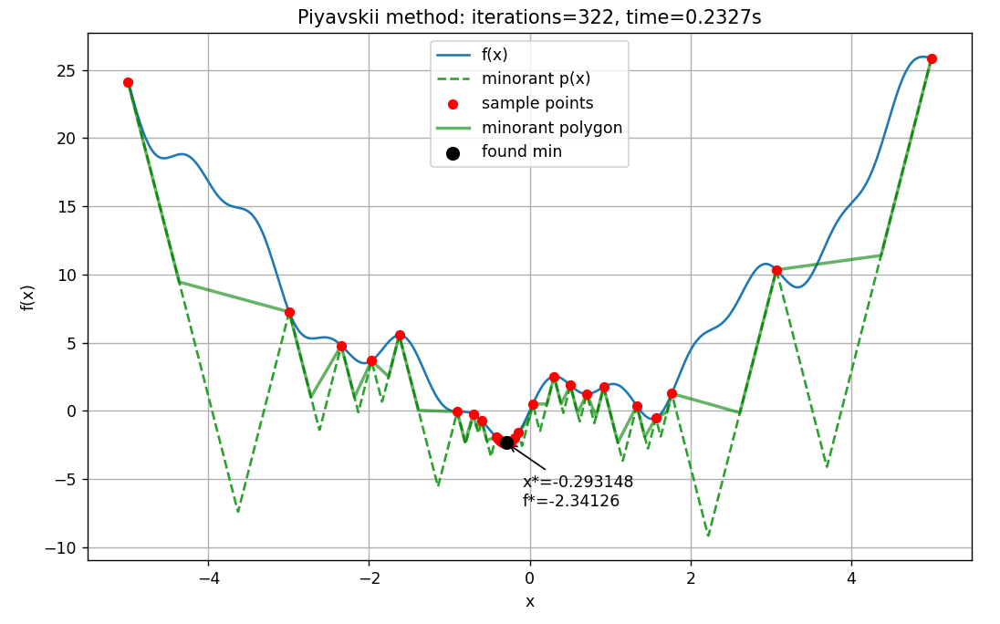
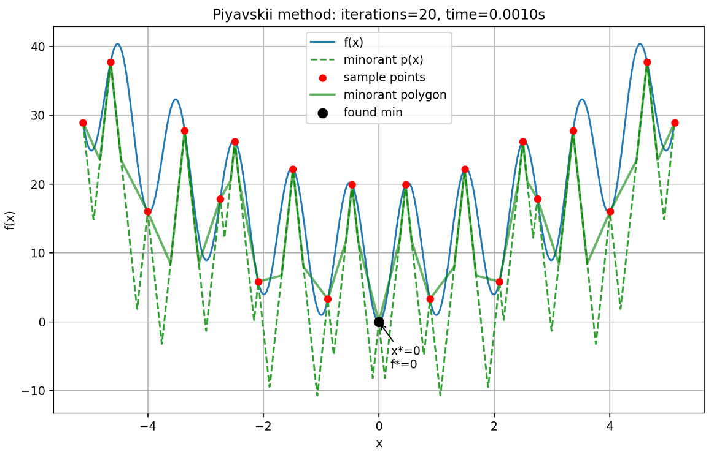

# Отчет по лабораторной работе: Метод ломаных

### Выполнила: Смирнова Карина Андреевна Поток 1.1 К3341

### Задание:
Разработайте программу на языке Python или подобном (C++, Java...), которая будет решать задачу поиска глобального экстремума для заданной функции на заданном отрезке. 

На вход программа принимает строку одномерной функции, например f(x) = x + sin(3.14159*x) (она заведомо должна являться
липшицевой), координаты концов отрезка (вещественные числа), точность вычисления eps (например, 0,01). На выходе она 
выполняет визуализацию графика исходной функции, вспомогательных функций (по возможности итоговой ломаной, на которой 
достигнута требуемая точность), приближенное значение аргумента и минимального значения функции, число пробовавшихся 
итераций, потраченной время. 

Программа должна быть либо в Jupiter Notebook или в репозитории. Должно быть продемонстрирована работа программы на 
тестовой функции (любой одномерный сред двумерной функции): функция  Растригина, функция Экли и др., но с наличием не 
менее двух локальных минимумов на заданном отрезке. 

Результаты расчетов должны отражаться в виде визуализации (функция, ломаная линия или вспомогательные функции, указание 
места найденного приближенного значения аргумента и соответствующей точки минимума), приближенные значения аргумента и 
функции, число итераций, затраченное время для расчетов. Демонстрация должна быть отражена в PDF файле, который вместе 
ссылкой на файл с кодом, с файл визуализация и(или) файл Jupiter Notebook, размещается в Moodle в ответ на это задание.

### Суть метода:

Метод Пиявского — глобальный детерминированный метод поиска минимума непрерывной функции на отрезке [a, b], при 
известной или оценённой константе Липшица L для f.

Идея: построить нижнюю аппроксимацию (минoранту) функции p(x) = max_i { f(x_i) - L * |x - x_i| }, где {x_i} — уже 
исследованные точки. Минимум этой минoранты служит оценкой места, где может лежать глобальный минимум f. В выбранной 
точке вычисляют f, добавляют её в набор и обновляют минoранту; процесс повторяют до заданной точности.

### Логика вычислений:

1. Преобразует строковое представление функции в callable f(x) (make_function_from_string).
2. Оценивает константу Липшица L:
    * Через sympy если есть — берёт производную и на сетке оценивает максимум |f'(x)|;
    * Или оценивает L по конечным разностям на равномерной сетке и увеличивает оценку на 10% (запас).
3. Инициализирует метод (класс Piyavskiy) с начальными точками — концами отрезка.
4. Круг вычислений:
    * вычисляет кандидатов для минимума минoранты (включая пересечения пар соседних «линий» gi(x) = fi - L*(x-xi) и gj(x) = fj - L*(xj-x)),
    * берёт точку x*, где p(x) минимальна,
    * вычисляет f(x*); если разность f(x*) - p(x*) < eps — добавляет точку и останавливается; иначе добавляет точку и повторяет.
5. Возвращает найденную точку с наименьшим f среди исследованных, количество итераций, время, историю итераций и набор точек.
6. Визуализирует исходную функцию, минoранту и точки выбора.

### Описание классов и методов:

* make_function_from_string(expr): Преобразует строку с функцией в callable f(x), разрешает базовые функции math 
(sin, cos, exp, pi и т. п.). Убирает часть «f(x)=» если есть.
* estimate_lipschitz_constant(f, a, b, ...): сначала пробует sympy, иначе — n_samples точек и конечные разности; 
добавляет запас 10% и гарантирует положительную величину (минимум 1e-6).
* Класс Piyavskiy:
  * points: список известных пар (x_i, f_i).
  * minorant_value(x): вычисляет p(x) = max_i (f_i - L*|x-x_i|).
  * minimizers_candidates(): формирует кандидатов: все узлы + аналитические точки пересечения соседних прямых на каждом отрезке + границы отрезка. Удаляет близкие дубли по округлению.
  * next_sample_point(): возвращает кандидат с минимальным p(x).
  * run(eps, max_iter): основной цикл; условие останова f(x*) - p(x*) < eps; возвращает структуру с результатом и историей.
* plot_result(...): строит график f(x), p(x), точки выборки, отмечает найденный минимум и сохраняет/показывает картинку.

### Пример:

Для функции "x**2 + 2*(sin(3*x) + 0.5*sin(7*x))" на a=-5.0, b=5.0, eps=1e-3

Для функции "10 + x**2 - 10*cos(2*pi*x)" на a=-5.12, b=5.12, eps=1e-3

### Вывод

В этой лабораторной работе я изучила метод ломаных для нахождения локального минимума непрерывной функции на отрезке,
а также оценивать константу Лепшница.